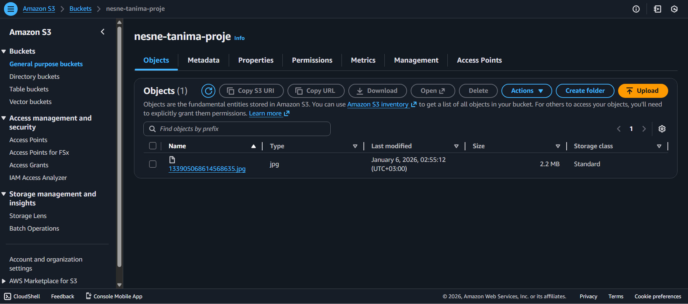
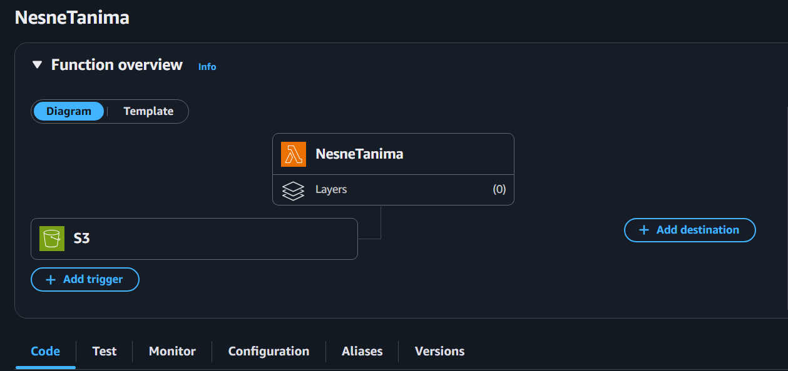
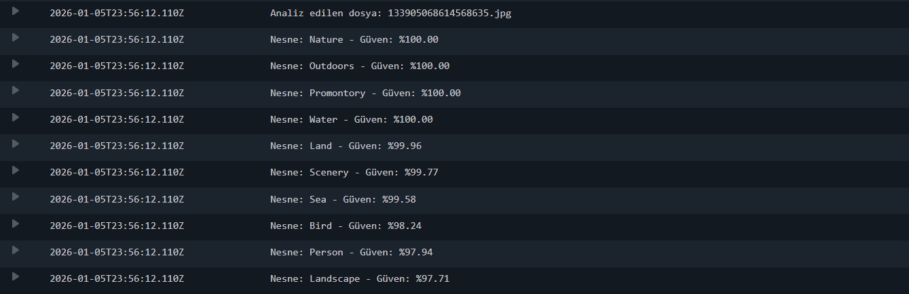

# AWS-Rekognition-Nesne-Tanima-Projesi

## Mimari
1. Kullanıcı S3 Bucket'ına bir görsel yükler.
2. S3 "ObjectCreated" olayı Lambda fonksiyonunu tetikler.
3. Lambda, görseli Amazon Rekognition'a gönderir.
4. Sonuçlar CloudWatch Logs üzerinde listelenir.

## Kullanılan Servisler
- **Amazon S3:** Görsel depolama.
- **AWS Lambda:** Serverless işleme.
- **Amazon Rekognition:** Derin öğrenme tabanlı nesne tanıma.
- **IAM:** Yetkilendirme ve roller.

Herhangi bir maliyet çıkmaması için Free-Tier katmanında yapılmıştır.

